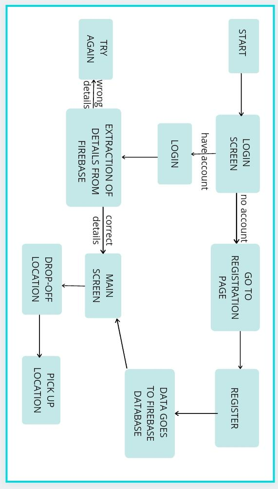
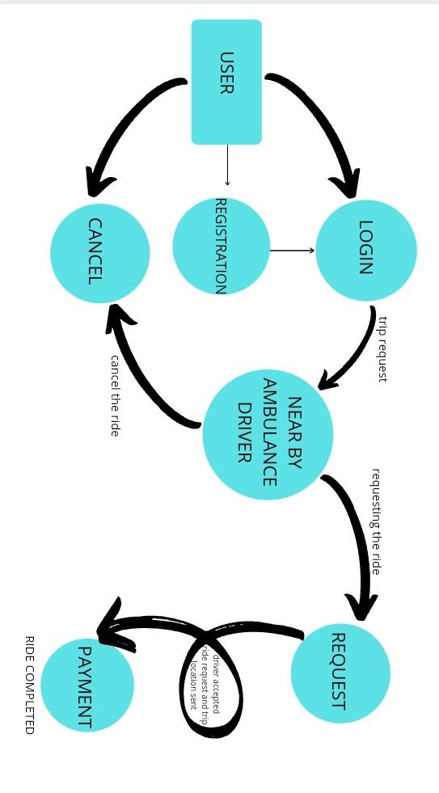

# Sanjeevni App for Ambulance and Nursing Services

The app provides the user with the details of the near-by ambulance services by using the current location of the user.Amid Covid-19, the app focuses on connecting the user to the ambulance driver. The user can submit a trip request that is automatically sent to the nearby ambulance driver, alerting the driver with the current location of the user.The accepting ambulance driver will then come and pick the patient from the given location and drive them to the nearby hospital.

# The app displays three screens:

# Login Screen-

Login screen let the user to login to their account which has been registered earlier. It logins with firebase. Details have been stored in firebase database during registration and it works in real time and checks login details we have entered whether it's correct or not.If it's correct the user gets the next screen and if it is not then it shows the user the details that are not correct.

# Registration Screen-

Registration Screen can be used by the user to make the new registration. The data entered by the user is stored in the firebase database.If a user already has an account then they can click on the 'login' option, which will redirect them to the login screen.

# Main Screen-

In the Main screen you can enter your pickup location you want to be picked up from and destination address/Hospital In the “drop off” box,based on your location ETAs and pricing would be displayed.
Click on the “Request” button to book your service. You can also cancel the ambulance.
Main Screen also uses Geocoding and Reverse Geocoding APIs.The Geocoding API finds the address for a given place ID, while reverse geocoding is the process of converting geographic coordinates into a human-readable address.

# Hardware and Software Requirements

1. Android 7.0 and newer
2. Single Sim Card
3. Minimum RAM of 2 GB
4. Processor Speed (GHz) Minimum processor speed of 2 GHZ
5. Location Hardware Device must have a GPS chip.

# Process Flow

# Data Flow Diagram

